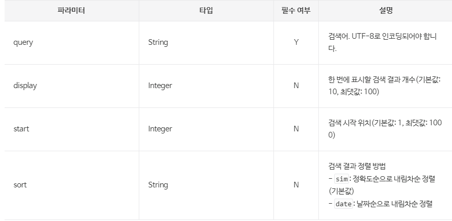

## 2024/02/10 restTemplate -> webclient로 교체 
1. 한글 깨지는 부분 uri 생성시 인코딩을 통해 해결
    
2. 로그에 한글 출력x
# 함수 내부 리팩토링 진행
## AWS lambda로 TTS 성능개선 하기
 로그관련 작업, 모니터링 툴(엑추에이터, 그라파나, 프로메테우스)
- ## 엑추에이터
  - 액추에이터 개요
    - 액추에이터는 실행 중인 애플리케이션의 내부를 볼 수 있게 하고, 어느 정도까지는 애플리케이션의 작동 방법을 제어할 수 있게 한다. 예를 들면, 다음과 같다.
    - 애플리케이션 환경에서 사용할 수 있는 구성 속성들
    - 애플리케이션에 포함된 다양한 패키지의 로깅 레벨(logging level)
    - 애플리케이션이 사용 중인 메모리
    - 지정된 엔드포인트가 받은 요청 횟수 
    - 애플리케이션의 건강 상태 정보

- ## 프로메테우스
  - Micrometer는 JVM 기반 애플리케이션에서 다양한 메트릭(지표)을 수집하고 측정하기 위한 라이브러리입니다. 여기서 메트릭이란 애플리케이션의 상태나 성능을 나타내는 수치 정보를 말합니다. 예를 들어 API 응답 시간, 에러 발생 횟수, CPU 사용률 등이 메트릭에 해당합니다.
  - Micrometer는 이런 메트릭을 수집하기 위한 표준화된 방법을 제공합니다. 개발자는 Micrometer가 제공하는 API를 사용해서 애플리케이션 코드 내에 메트릭 수집 로직을 삽입할 수 있습니다. 그러면 Micrometer가 해당 메트릭 정보를 수집하고 외부로 전송합니다.
    이때 Micrometer는 메트릭 정보를 전송할 대상 시스템을 추상화하고 있습니다. 따라서 개발자는 애플리케이션 코드를 수정하지 않고도, Micrometer와 연동할 모니터링 시스템을 자유롭게 변경할 수 있습니다. Micrometer는 **Prometheus**, Atlas, Datadog 등 다양한 모니터링 시스템을 지원하고 있습니다.
- ## 그라파나

# Redis로 cache 도입(RedisTemplate)
# 멀티 쓰레드 도입(보류)
# spring security 적용
1. jwt 토큰
TokenProvider 클래스:

TokenProvider 클래스는 JWT 토큰을 생성하고 검증하는 역할을 담당합니다.
@Configuration 어노테이션을 사용하여 Spring의 설정 클래스로 선언됩니다.
secret 변수는 JWT 토큰의 서명에 사용되는 비밀 키를 저장합니다. 이 값은 application.properties 또는 application.yml 파일에서 jwt.secretKey 속성을 통해 주입됩니다.
tokenValidityInMilliseconds 변수는 토큰의 유효 기간을 밀리초 단위로 설정합니다.
createToken 메서드는 주어진 User 객체를 기반으로 JWT 토큰을 생성합니다.
getSubject 메서드는 주어진 JWT 토큰에서 subject(여기서는 사용자의 이메일)을 추출합니다.
validateToken 메서드는 주어진 JWT 토큰의 유효성을 검사합니다.

JwtAuthenticationFilter 클래스:

JwtAuthenticationFilter 클래스는 JWT 토큰을 이용한 인증을 수행하는 필터입니다.
OncePerRequestFilter를 상속받아 구현됩니다.
클라이언트의 요청이 들어오면, 이 필터는 요청 헤더에서 JWT 토큰을 추출합니다.
추출한 토큰의 유효성을 TokenProvider를 사용하여 검사합니다.
토큰이 유효한 경우, 토큰에서 사용자 정보를 추출하고 UserDetailsService를 사용하여 사용자 세부 정보를 로드합니다.
로드된 사용자 정보를 기반으로 Authentication 객체를 생성하고 SecurityContext에 설정합니다.
인증된 사용자 정보를 가지고 요청을 다음 필터로 전달합니다.

SecurityConfig 클래스:

SecurityConfig 클래스는 Spring Security 설정을 구성하는 클래스입니다.
@Configuration 어노테이션과 @EnableWebSecurity 어노테이션을 사용하여 Spring Security 설정 클래스로 선언됩니다.
JwtAuthenticationFilter를 주입받아 사용합니다.
configure(HttpSecurity http) 메서드를 오버라이드하여 인증 및 권한 설정을 구성합니다.
HTTP Basic 인증을 비활성화하고, CSRF 보호를 비활성화합니다.
세션 생성 정책을 STATELESS로 설정하여 서버에서 세션을 사용하지 않도록 합니다.
인증이 필요한 요청 경로와 permitAll()을 사용하여 인증이 필요하지 않은 경로를 설정합니다.
JwtAuthenticationFilter를 UsernamePasswordAuthenticationFilter 앞에 추가하여 JWT 인증을 수행하도록 합니다.

JWT 토큰 관련 로직의 흐름은 다음과 같습니다:

사용자가 로그인 정보를 입력하고 로그인 요청을 보냅니다.
서버에서 로그인 정보를 확인하고, 일치하는 경우 TokenProvider를 사용하여 JWT 토큰을 생성합니다.
생성된 JWT 토큰을 클라이언트에게 응답으로 전달합니다.
클라이언트는 이후의 요청에서 전달받은 JWT 토큰을 Authorization 헤더에 포함하여 서버로 보냅니다.
서버에서는 JwtAuthenticationFilter가 요청을 가로채고, 헤더에서 JWT 토큰을 추출합니다.
TokenProvider를 사용하여 JWT 토큰의 유효성을 검사합니다.
토큰이 유효한 경우, 토큰에서 사용자 정보를 추출하고 UserDetailsService를 사용하여 사용자 세부 정보를 로드합니다.
로드된 사용자 정보를 기반으로 Authentication 객체를 생성하고 SecurityContext에 설정합니다.
인증된 사용자 정보를 가지고 요청을 다음 필터로 전달하고, 최종적으로 컨트롤러에서 처리됩니다.

이렇게 TokenProvider, JwtAuthenticationFilter, SecurityConfig 클래스들이 상호 작용하여 JWT 토큰 기반의 인증 및 인가 프로세스를 구현합니다.
# 도커에 올리기
